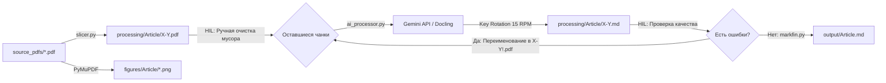

# PDF to RAG Markdown Pipeline


> **Пайплайн извлечения мультимодальных данных из научных PDF для RAG-систем с подходом Human-in-the-Loop**
>
> *Версия проекта: **Release 1.0.0** (Первый стабильный релиз)*

---

## 🇷🇺 Содержание

- [Описание и ценность](#-описание-и-ценность)
- [Ключевые возможности](#-ключевые-возможности)
- [Архитектура и рабочий процесс](#-архитектура-и-рабочий-процесс)
- [Установка](#-установка)
- [Конфигурация](#-конфигурация)
- [Использование](#-использование)
- [Руководство по Human-in-the-Loop (HIL)](#-руководство-по-human-in-the-loop-hil)
- [Структура проекта](#-структура-проекта)
- [Лицензия](#-лицензия)

---

## 📖 Описание и ценность

**PDF to RAG Markdown Pipeline** — это модульный Python-пайплайн для высокоточной конвертации сложных научных статей (PDF) в чистый Markdown, оптимизированный для систем **Retrieval-Augmented Generation (RAG)** и мультимодального анализа данных (**Multimodal Data Extraction**).

### Какую проблему решает проект?

- При подаче длинных PDF целиком большие языковые модели часто пропускают абзацы, теряют контекст и искажают данные. Нарезка на 2-страничные чанки минимизирует когнитивную нагрузку на модель.
- Визуальное распознавание сетки таблиц и перевод в нативный Markdown (`| Column | Column |`) без потери колонок и пустых ячеек.
- Модель генерирует детальные смысловые блоки `[IMAGE DESCRIPTION: ...]` с осями, трендами, данными и подписями, а оригиналы графиков сохраняются в отдельную директорию `figures/`.
- Формулы и математические выражения автоматически размечаются в стандартном синтаксисе `$ ... $` и `$$ ... $$`.
- Пользователь вручную удаляет нерелевантные разделы (например, References или лицензионные страницы) до обращения к API.
- Возможность повторной генерации только сбойных страниц без переработки всей статьи заново.

---

## ✨ Ключевые возможности

- Быстрое и точное разрезание многостраничных PDF на 2-страничные чанки (`1-2.pdf`, `3-4.pdf`, `15.pdf`) с помощью `PyMuPDF`.
- Экспорт всех встроенных иллюстраций в высоком качестве (`figures/{article_name}/{index}.png`).
- Прямая передача PDF-страниц в модель `Gemini-3.5-flash-lite` через официальный SDK `google-genai`.
- Поддержка пула ключей с контролем лимита 15 RPM (запросов в минуту) на каждый ключ, автоматическим переключением при 429 и паузой при исчерпании лимитов.
- Добавление восклицательного знака к файлу (`1-2!.pdf`) инициирует повторную обработку только этого чанка с перезаписью `.md` и автоматическим возвратом имени к `1-2.pdf`.
- Возможность переключения на алгоритмический экстрактор `Docling` (`1-2!d.pdf`) для специфических табличных структур.
- Системный промпт хранится отдельно в `prompts/processing-prompt.md`.
- Числовая сортировка и сшивание готовых чанков в единый документ `output/{article_name}.md`.
- Информативные таблицы состояния, индикаторы прогресса и цветное логирование на базе библиотеки `Rich`.

---

## 🏗 Архитектура и рабочий процесс



### Этапы пайплайна

1. **Slicing**: Исходные PDF из `source_pdfs/` нарезаются по 2 страницы в `processing/{article_name}/`, а изображения извлекаются в `figures/{article_name}/`.
2. **HIL Filtering**: Пользователь удаляет из `processing/{article_name}/` файлы со страницами References и служебной информацией.
3. **AI Processing**: Скрипт считывает системный промпт из `prompts/processing-prompt.md`, передает каждый чанк в `Gemini-3.5-flash-lite` и сохраняет результат в `X-Y.md`.
4. **HIL Retry**: Если в каком-то чанке найдена ошибка, файл переименовывается в `X-Y!.pdf` и перезапускается процессинг.
5. **Merging**: Скрипт `markfin.py` сшивает все `.md` чанки в итоговый файл в папке `output/`.

---

## 🚀 Установка

### 1. Клонирование репозитория

```bash
git clone https://github.com/ViacheTix/RAGify-PDF.git
cd RAGify-PDF
```

### 2. Создание и активация виртуального окружения

```bash
# Использование стандартного venv:
python -m venv venv
source venv/bin/activate  # Для Linux/macOS
# venv\Scripts\activate   # Для Windows

# Либо через Conda / Mamba:
mamba create -n retro-rag python=3.10 -y
mamba activate retro-rag
```

### 3. Установка зависимостей

```bash
pip install -r requirements.txt
```

---

## ⚙️ Конфигурация

Создайте файл `.env` в корневой директории проекта (на основе `.env.example`):

```bash
cp .env.example .env
```

Отредактируйте `.env`, указав один или несколько ключей Google Gemini API через запятую:

```env
# Список API-ключей Google Gemini для Round-Robin ротации.
# Несколько ключей позволяют линейно увеличить скорость обработки (15 RPM на каждый ключ).
GEMINI_API_KEYS="AIzaSyA...key1,AIzaSyB...key2,AIzaSyC...key3"
```

> **Механизм ротации:** `APIKeyManager` отслеживает скользящее 60-секундное окно для каждого ключа. Если ключ достигает 15 запросов в минуту или возвращает ошибку `429 Too Many Requests`, менеджер автоматически переключается на следующий свободный ключ. При исчерпании квоты всех ключей скрипт делает паузу до сброса ближайшего окна.

---

## 💻 Использование

Управление всем пайплайном доступно через единый интерфейс `main.py` (или отдельные скрипты в `scripts/`):

### 1. Проверка текущего состояния пайплайна

```bash
python main.py status
```

*Выводит сводную таблицу по всем статьям: наличие исходного PDF, количество чанков, готовых `.md`, статус HIL и итоговых файлов.*

### 2. Нарезка PDF и извлечение изображений

```bash
python main.py slice
```

*Параметры:*

- `source` — путь к папке с PDF или конкретному файлу (по умолчанию `source_pdfs`).
- `-c, --chunk-size` — количество страниц в чанке (по умолчанию `2`).
- `--no-images` — отключить извлечение фигур.
- `--force` — перезаписать существующие чанки.

### 3. Извлечение текста в Markdown через Gemini API

```bash
python main.py process
```

*Параметры:*

- `-a, --article` — имя конкретной статьи для обработки.
- `-m, --model` — модель Gemini (по умолчанию `gemini-3.5-flash-lite`).
- `--rpm-limit` — лимит запросов на один ключ в минуту (по умолчанию `15`).
- `--prompt-path` — путь к файлу системного промпта (по умолчанию `prompts/processing-prompt.md`).

### 4. Финальное слияние Markdown

```bash
python main.py merge
```

*Параметры:*

- `-a, --article` — объединить конкретную статью.
- `-o, --output-dir` — папка назначения (по умолчанию `output`).
- `--page-comments` — добавить HTML-комментарии с границами страниц.

### 5. Полный цикл одной командой

```bash
python main.py all
```

---

## 🧑‍💻 Руководство по Human-in-the-Loop (HIL)

Механизм Human-in-the-Loop позволяет получить максимальное качество и сэкономить токены:

1. **Экономия токенов (Фильтрация):**
   - Запустите `python main.py slice`.
   - Откройте папку `processing/{название_статьи}/`.
   - Удалите файлы страниц со списком литературы (References), приложениями или рекламными страницами. Удаленные файлы **никогда не будут отправлены в API**.

2. **Точечное исправление ошибок (Retry):**
   - Если в сгенерированном файле `3-4.md` вы заметили неточность, переименуйте PDF-чанк в `3-4!.pdf`.
   - Запустите `python main.py process`.
   - Скрипт обработает **только** помеченный чанк, перезапишет `3-4.md` и автоматически вернет имя файла обратно в `3-4.pdf`.

3. **Резервный парсинг таблиц (Docling):**
   - Если модель систематически ошибается на сложной таблице, переименуйте файл в `3-4!d.pdf`.
   - При запуске `python main.py process` файл будет обработан парсером `Docling`.

---

## 📁 Структура проекта

```text
pdf-markdown-api/
├── context/                        # Архитектурная документация и спецификации
│   ├── architecture.md
│   ├── code-standards.md
│   ├── project-overview.md
│   └── ...
├── figures/                        # Извлеченные изображения (figures/{article}/{index}.png)
├── output/                         # Финальные объединенные Markdown-файлы
├── processing/                     # Рабочая база данных: чанки (X-Y.pdf) и результаты (X-Y.md)
├── prompts/                        # Внешние системные промпты
│   └── processing-prompt.md
├── scripts/                        # Модули пайплайна
│   ├── __init__.py
│   ├── ai_processor.py            # Обработка через Gemini API, ротация ключей и HIL
│   ├── markfin.py                 # Финальное слияние чанков
│   ├── pipeline.py                # Оркестратор пайплайна
│   └── slicer.py                  # Нарезка PDF и извлечение изображений
├── source_pdfs/                    # Исходные файлы PDF (Read-only)
├── .env                            # Переменные окружения (API-ключи)
├── .env.example                    # Пример конфигурационного файла
├── main.py                         # Главная консольная точка входа
├── requirements.txt                # Зависимости проекта
└── README.md                       # Двуязычная документация
```

---

## 📄 Лицензия

Проект распространяется под лицензией **MIT**. Подробности в файле LICENSE.

---

# PDF to RAG Markdown Pipeline


> **A Human-in-the-Loop Multimodal Data Extraction Pipeline for Converting Scientific PDFs into Clean RAG-Ready Markdown**
>
> *Project Version: **Release 1.0.0** (First Stable Release)*

---

## 🇬🇧 Table of Contents

- [Overview & Value Proposition](#-overview--value-proposition)
- [Key Features](#-key-features)
- [Architecture & Workflow](#-architecture--workflow)
- [Installation](#-installation)
- [Configuration](#-configuration)
- [Usage](#-usage)
- [Human-in-the-Loop (HIL) Guide](#-human-in-the-loop-hil-guide)
- [Project Structure](#-project-structure)
- [License](#-license)

---

## 📖 Overview & Value Proposition

**PDF to RAG Markdown Pipeline** is a modular Python toolkit engineered for high-fidelity **PDF Parsing**, **OCR**, and **Multimodal Data Extraction** from complex scientific research papers into clean, verbatim Markdown tailored for **Retrieval-Augmented Generation (RAG)** systems and LLM reasoning.

### What Problems Does This Solve?

- Processing full multi-page PDFs often leads to missed paragraphs and structural degradation. Slicing documents into 2-page chunks eliminates context saturation.
- Visual structure recognition converts tables directly into standard Markdown tables (`| Col1 | Col2 |`), preserving column alignments and empty cells.
- Converts visual graphics into detailed structured descriptions `[IMAGE DESCRIPTION: ...]` (extracting axes, legends, trends, numbers, and captions), while preserving full-resolution image assets in `figures/`.
- Inline and block mathematical notation is formatted as standard LaTeX `$ ... $` and `$$ ... $$`.
- Users can inspect and prune non-informative sections (such as References or cover sheets) before sending data to the API.
- Reprocess only individual failed pages without re-running the entire document.

---

## ✨ Key Features

- Chunks large PDFs into manageable 2-page units (`1-2.pdf`, `3-4.pdf`, `15.pdf`) using `PyMuPDF`.
- Extracts all embedded raster images into `figures/{article_name}/{index}.png`.
- Connects to `Gemini-3.5-flash-lite` via the modern `google-genai` SDK.
- Automatically cycles through multiple Gemini API keys while enforcing a strict 15 RPM per-key limit, seamlessly handling 429 quota errors.
- Renaming a chunk to `1-2!.pdf` forces re-extraction for that specific chunk, overwriting its `.md` output and renaming the source back to `1-2.pdf`.
- Flag difficult chunks with `1-2!d.pdf` to process them via the `Docling` document converter.
- Prompts are stored in `prompts/processing-prompt.md`, isolated from the codebase.
- Numerically sorts and joins Markdown chunks into unified documents in `output/{article_name}.md`.
- Clean console interface with colored progress bars, summary tables, and status tracking.

---

## 🏗 Architecture & Workflow


### Pipeline Stages

1. **Slicing**: Source PDFs in `source_pdfs/` are split into 2-page chunks in `processing/{article}/`, and embedded images are saved to `figures/{article}/`.
2. **HIL Filtering**: The user removes non-relevant chunks (References, bibliographies, etc.) from `processing/`.
3. **AI Processing**: `ai_processor.py` reads `prompts/processing-prompt.md`, calls `Gemini-3.5-flash-lite`, and outputs `X-Y.md`.
4. **HIL Retry**: Any faulty chunk is flagged with `!` (`1-2!.pdf`) to trigger targeted re-generation.
5. **Merging**: `markfin.py` concatenates all `.md` chunks into `output/{article}.md`.

---

## 🚀 Installation

### 1. Clone the repository

```bash
git clone https://github.com/ViacheTix/RAGify-PDF.git
cd RAGify-PDF
```

### 2. Set up a virtual environment

```bash
# Using standard venv:
python -m venv venv
source venv/bin/activate  # On Linux/macOS
# venv\Scripts\activate   # On Windows

# Or using Conda / Mamba:
mamba create -n retro-rag python=3.10 -y
mamba activate retro-rag
```

### 3. Install dependencies

```bash
pip install -r requirements.txt
```

---

## ⚙️ Configuration

Copy the sample environment file and configure your API keys:

```bash
cp .env.example .env
```

Add your Google Gemini API key(s) to `.env`:

```env
# Comma-separated list of Google Gemini API keys for Round-Robin rotation.
# Adding multiple keys scales your processing throughput (15 RPM per key).
GEMINI_API_KEYS="AIzaSyA...key1,AIzaSyB...key2,AIzaSyC...key3"
```

> **Key Rotation & Rate Limiting:** The `APIKeyManager` maintains a sliding 60-second window for each key. If a key hits 15 RPM or receives a `429 Too Many Requests` response, the manager instantly switches to the next available key. If all keys are maxed out, it pauses until the earliest window resets.

---

## 💻 Usage

Execute commands via the unified CLI `main.py` (or individual scripts under `scripts/`):

### 1. View Pipeline Status

```bash
python main.py status
```

*Displays an overview table with document counts, chunk statuses, HIL flags, and final output readiness.*

### 2. Slice PDFs & Extract Figures

```bash
python main.py slice
```

*Options:*

- `source` — Path to source directory or a single PDF (default: `source_pdfs`).
- `-c, --chunk-size` — Pages per chunk (default: `2`).
- `--no-images` — Disable image extraction.
- `--force` — Overwrite existing chunk files.

### 3. Process Chunks via Gemini API

```bash
python main.py process
```

*Options:*

- `-a, --article` — Process a single article folder.
- `-m, --model` — Gemini model identifier (default: `gemini-3.5-flash-lite`).
- `--rpm-limit` — RPM limit per API key (default: `15`).
- `--prompt-path` — Path to prompt file (default: `prompts/processing-prompt.md`).

### 4. Merge Chunks into Final Markdown

```bash
python main.py merge
```

*Options:*

- `-a, --article` — Merge a specific article.
- `-o, --output-dir` — Destination folder (default: `output`).
- `--page-comments` — Add HTML comments for chunk page boundaries.

### 5. Run Full End-to-End Pipeline

```bash
python main.py all
```

---

## 🧑‍💻 Human-in-the-Loop (HIL) Guide

The Human-in-the-Loop philosophy ensures high precision while saving API tokens:

1. **Pre-filtering (Save Tokens):**
   - Run `python main.py slice`.
   - Open `processing/{article_name}/`.
   - Delete chunks containing references or non-essential pages. Deleted chunks are **never sent to the API**.

2. **Targeted Retry (`!` Marker):**
   - If `3-4.md` has an error or hallucination, rename `3-4.pdf` to `3-4!.pdf`.
   - Run `python main.py process`.
   - The script will re-process **only** the marked chunk, overwrite `3-4.md`, and automatically rename `3-4!.pdf` back to `3-4.pdf`.

3. **Algorithmic Docling Fallback (`!d` Marker):**
   - If an intricate table fails with Gemini, rename the chunk to `3-4!d.pdf`.
   - Running `python main.py process` will convert that chunk using the `Docling` engine.

---

## 📁 Project Structure

```text
pdf-markdown-api/
├── context/                        # Architectural documentation and specs
│   ├── architecture.md
│   ├── code-standards.md
│   ├── project-overview.md
│   └── ...
├── figures/                        # Extracted images (figures/{article}/{index}.png)
├── output/                         # Final merged Markdown documents
├── processing/                     # Working FS-database: chunks (X-Y.pdf) & results (X-Y.md)
├── prompts/                        # Isolated LLM system prompts
│   └── processing-prompt.md
├── scripts/                        # Pipeline implementation
│   ├── __init__.py
│   ├── ai_processor.py            # Gemini API caller, key rotator & HIL handler
│   ├── markfin.py                 # Markdown chunk merger
│   ├── pipeline.py                # Pipeline orchestrator
│   └── slicer.py                  # PDF slicer & figure extractor
├── source_pdfs/                    # Original PDF documents (Read-only)
├── .env                            # Environment variables (API keys)
├── .env.example                    # Sample configuration template
├── main.py                         # Unified CLI entry point
├── requirements.txt                # Python dependencies
└── README.md                       # Bilingual documentation
```

---

## 📄 License

This project is licensed under the **MIT License**.
